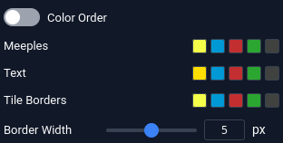
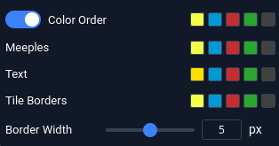
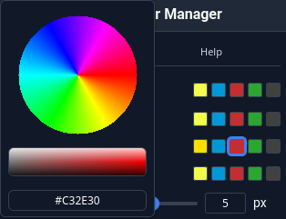

# BGA Carcassonne Color Manager - Browser Extension

## Introduction
This extension allows you to customize the following features in Carcassonne games on Board Game Arena (BGA):

- Meeple Colors
- Text Colors
- Tile Border Colors
- Tile Border Width

## Instructions
1. Navigate to any Carcassonne game (live or replay) on Board Game Arena.
2. Click the extension icon in your browser toolbar to open settings.
3. Use the switch next to the popup’s title to turn the extension on or off.

### Colors Tab
You will see:

- A Color Order toggle
- A Meeple row with 5 color swatches
- A Text row with 5 color swatches
- A Tile Borders row with 5 color swatches
- A Border Width slider and input box

#### Color Order OFF (Default)
The 3 three rows of swatches determine the colors of their associated game elements. If you change the yellow swatch (upper left) to orange, all yellow meeples are replaced with orange ones.

#### Color Order ON
Turning Color Order ON will pop up another row of swatches above the original 3. These serve as **headers** for each column of swatches. Each appears the same color as the Meeple swatch directly below it in that column. You can reorder the columns by dragging these headers.

In this mode, the columns are associated with players, as ordered in the BGA display. The leftmost column will determine the Meeple, Text and Tile Border colors for the first player displayed, the column to its right for the second player displayed, and so on.

In this mode, you can also reverse the ordered of colors currently in use by clicking on any player board.

In **either** mode, hovering over a Meeple, Text or Tile Border swatch will pop up a tooltip naming its original color.

#### Changing Colors
Clicking a swatch will open a popup with a color wheel, saturation slider and text input box.

- The color wheel determines basic color (yellow, green, etc.).
- The saturation slider determines brightness/saturation.
- The text input box can be used to set an exact color using a [color hex code](https://www.w3schools.com/colors/colors_picker.asp).

#### Changing Tile Border Width
Tile border width is set at 5px by default. This can be increased or decreased using the slider, or by inputting a number of pixels.

### Help Tab
Here you can:

- Save colors (synced via your browser account) and restore
- Copy colors to the clipboard and import colors by pasting them
- Reset colors
- Find links to Github repository, issues, discussions
- Set Log level control
- Toggle verbose logging

## Known Issues
This extension does not have all expansion meeples, and will replace those with standard meeples. It is therefore recommended that you turn the extension off when playing relevant expansion games. (If you’d like support please supply expansion meeples in svg format.)

## Browser Compatibility
- **Firefox**: 140+ (Manifest v3)
- **Chrome**: 99+ (Manifest v3)
- **Edge**: 99+ (Chromium-based)
- **Safari**: Not supported

## Support
- **Issues**: [GitHub Issues](https://github.com/yzemaze/bga-carcassonne-color-manager/issues)
- **Discussions**: [GitHub Discussions](https://github.com/yzemaze/bga-carcassonne-color-manager/discussions)

## Contributing
Pull requests are welcome. See [BUILD.md](BUILD.md) for development setup and build instructions.

## License
GPL-3.0-or-later - See [LICENSE](LICENSE) file for details.
