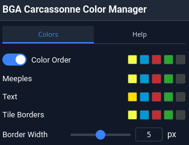
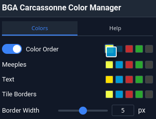
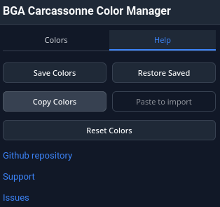

# BGA Carcassonne Color Manager - Browser Extension

## Features
- **Player Colors Order**: Select your preferred color order. Ensure you always get your favorite color.
- **Text Colors**: Player names are displayed in your chosen colors.
- **Meeple Colors**: Custom meeples with user-selected base colors and automatic tint calculation.
- **Tile Borders**: Customizable colors and width for player tile borders.
- **Persistent Settings**: All settings are saved in your browser’s storage.
- **Color Sets**: Save your colors synced across your browsers, restore them anytime and share them via clipboard.

## Screenshots

| Colors tab | Reordering colors by drag & drop |
|---|---|
|  |  |
| **Color picker** | **Help tab** |
|  |  |

## Usage

### Getting Started
1. Navigate to any Carcassonne game (live/replay) on Board Game Arena.
2. Click the extension icon in your toolbar to access detailed settings.
3. Change text, meeple and tile border colors to your liking.
4. Activate `Color Order` and reorder colors by drag & dropping the color swatches next to it. (1st selected color will be yours or – if you’re just watching – the 1st listed player’s.)
5. Click on any player’s board to switch players’ colors.

Toggle `Color Order` to switch between user-defined and BGA’s original color assignments.

### Settings

#### Colors Tab
- Reorder color sequence and customize text, meeple and border colors.

#### Help Tab
- Save colors (synced via your browser account) and restore them
- Copy colors to the clipboard and import colors by pasting them
- Reset colors
- Links to repository, issues, discussions
- Log level control

## Browser Compatibility
- **Firefox**: 140+ (Manifest v3)
- **Chrome**: 99+ (Manifest v3)
- **Edge**: 99+ (Chromium-based)
- **Safari**: Not supported

## Support
- **Issues**: [GitHub Issues](https://github.com/yzemaze/bga-carcassonne-color-manager/issues)
- **Discussions**: [GitHub Discussions](https://github.com/yzemaze/bga-carcassonne-color-manager/discussions)

## Contributing
Pull requests are welcome. See [BUILD.md](BUILD.md) for development setup and build instructions.

## License
GPL-3.0-or-later - See [LICENSE](LICENSE) file for details.
